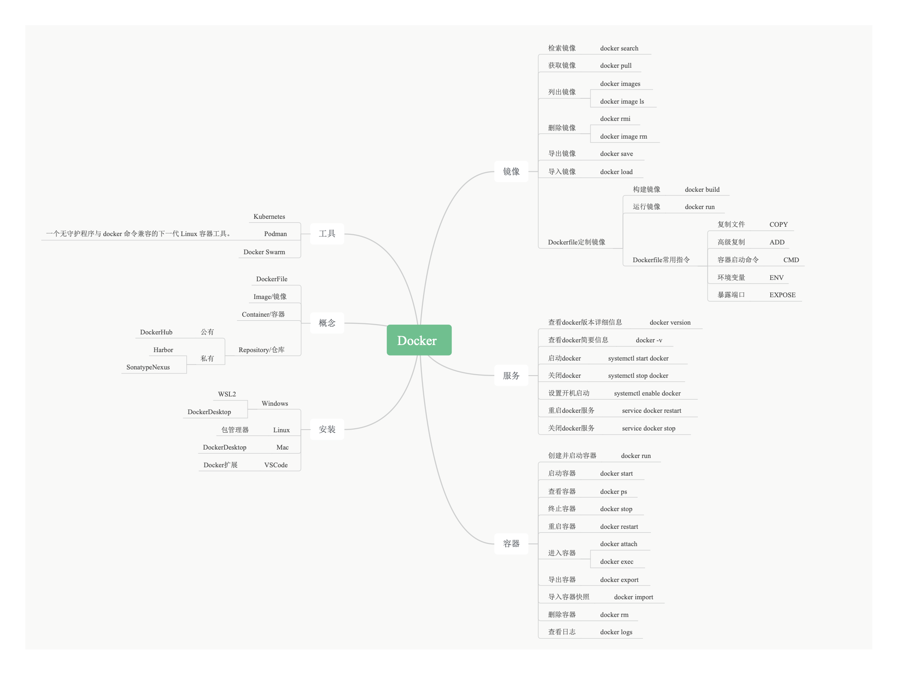

# Ubuntu系统下Docker和NVIDIA容器工具包安装指南

本指南将帮助您在Ubuntu系统上安装Docker和NVIDIA容器工具包，以便在容器中使用GPU加速。

## 前置条件

- Ubuntu 20.04 LTS或更高版本
- NVIDIA GPU
- 已安装NVIDIA驱动程序

## 1. 安装Docker

### 1.1 更新软件包索引

```bash
sudo apt-get update
```

### 1.2 安装必要的依赖

```bash
sudo apt-get install -y \
    apt-transport-https \
    ca-certificates \
    curl \
    gnupg \
    lsb-release
```

### 1.3 添加Docker官方GPG密钥

```bash
curl -fsSL https://download.docker.com/linux/ubuntu/gpg | sudo gpg --dearmor -o /usr/share/keyrings/docker-archive-keyring.gpg
```

```bash
sudo install -m 0755 -d /etc/apt/keyrings
curl -fsSL https://download.docker.com/linux/ubuntu/gpg | sudo gpg --dearmor -o /etc/apt/keyrings/docker.gpg
sudo chmod a+r /etc/apt/keyrings/docker.gpg
```

### 1.4 设置Docker仓库

```bash
echo \
  "deb [arch=$(dpkg --print-architecture) signed-by=/usr/share/keyrings/docker-archive-keyring.gpg] https://download.docker.com/linux/ubuntu \
  $(lsb_release -cs) stable" | sudo tee /etc/apt/sources.list.d/docker.list > /dev/null
```

```bash
echo \
  "deb [arch="$(dpkg --print-architecture)" signed-by=/etc/apt/keyrings/docker.gpg] https://download.docker.com/linux/ubuntu \
  "$(. /etc/os-release && echo "$VERSION_CODENAME")" stable" | \
  sudo tee /etc/apt/sources.list.d/docker.list > /dev/null
```

### 1.5 安装Docker Engine

```bash
sudo apt-get update
sudo apt-get install -y docker-ce docker-ce-cli containerd.io
```

### 1.6 验证Docker安装

```bash
sudo docker run hello-world
```

### 1.7 将当前用户添加到docker组（可选，但推荐）

```bash
sudo usermod -aG docker $USER
```

### 1.8 注意：需要重新登录才能使更改生效。

## 2. 安装NVIDIA容器工具包

### 2.1 设置NVIDIA包仓库

```bash
distribution=$(. /etc/os-release;echo $ID$VERSION_ID) \
   && curl -s -L https://nvidia.github.io/nvidia-docker/gpgkey | sudo apt-key add - \
   && curl -s -L https://nvidia.github.io/nvidia-docker/$distribution/nvidia-docker.list | sudo tee /etc/apt/sources.list.d/nvidia-docker.list
```

### 2.2 更新软件包列表

```bash
sudo apt-get update
```

### 2.3 安装NVIDIA容器工具包

```bash
sudo apt-get install -y nvidia-container-toolkit
sudo nvidia-ctk runtime configure --runtime=docker   #看下面注释
```

Note:

这是一个用于配置 NVIDIA 容器运行时的重要命令。让我详细解释其组成部分：

1. sudo: 以超级用户权限运行命令
2. nvidia-ctk: NVIDIA Container Toolkit 的命令行工具
3. runtime configure: 配置容器运行时
4. --runtime=docker: 指定要配置的容器运行时为 Docker

这个命令的主要作用是：* 将 NVIDIA 容器运行时配置为 Docker 的默认运行时

* 创建必要的配置文件，使 Docker 能够与 NVIDIA GPU 进行通信
* 设置正确的权限和路径，确保容器可以访问 GPU 资源

这个命令是安装 NVIDIA 容器工具包后的必要步骤，它确保了：1. Docker 容器可以正确识别和使用 NVIDIA GPU

1. 容器内的应用程序可以访问 GPU 资源
2. 系统正确配置了 GPU 相关的运行时参数

执行此命令后，您需要重启 Docker 守护进程（使用 sudo systemctl restart docker）才能使配置生效。

### 2.4 重启Docker守护进程

```bash
sudo systemctl restart docker
```

## 3. 验证NVIDIA容器工具包安装

### 3.1 测试NVIDIA容器

```bash
sudo docker run --rm --gpus all nvidia/11.6.1-base-ubuntu20.04 nvidia-smi
```

如果安装成功，您应该能看到GPU信息输出。

## 4. 常见问题解决

### 4.1 如果遇到权限问题

确保您已经将用户添加到docker组，并且已经重新登录。

### 4.2 如果NVIDIA容器无法启动

检查NVIDIA驱动程序是否正确安装：

```bash
nvidia-smi
```

### 4.3 如果遇到Docker服务问题

重启Docker服务：

```bash
sudo systemctl restart docker
```

## 5. 使用建议

- 始终使用 `--gpus all`参数来启用GPU支持
- 在Dockerfile中使用 `nvidia/cuda`基础镜像
- 确保容器内的CUDA版本与主机系统兼容

## 6. 参考资源

- [Docker官方文档](https://docs.docker.com/)
- [Install Docker Engine on Ubuntu](https://docs.docker.com/engine/install/ubuntu/)
- [NVIDIA容器工具包文档](https://docs.nvidia.com/datacenter/cloud-native/container-toolkit/overview.html)
- [NVIDIA CUDA文档](https://docs.nvidia.com/cuda/)
- Docker Xmind [[点击下载 Docker Xmind PDF](../assets/pdf/DockerXMind.pdf)]


---

希望本指南对您有所帮助！如果您遇到任何问题，请参考官方文档或社区支持。
